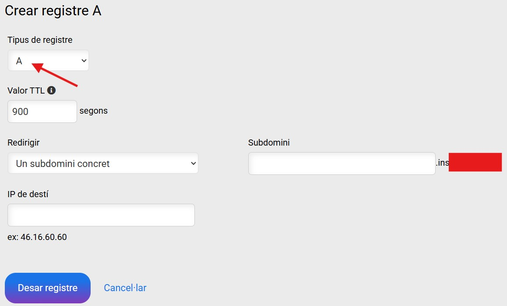
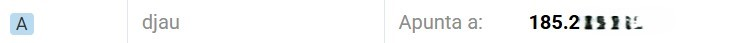
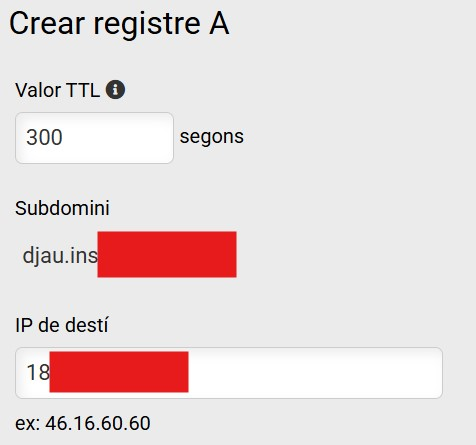
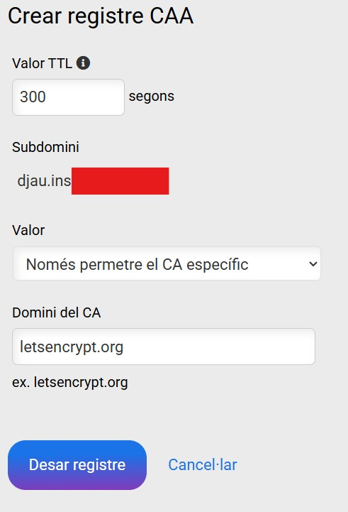
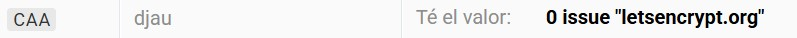
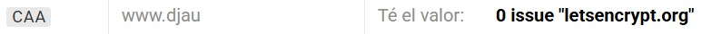

# Configuració de Registres DNS per a Accés Públic (VPS)

Per poder accedir a l'aplicació des d'Internet mitjançant un domini i no només per la IP, cal tenir un domini contractat i configurar els registres DNS que apunten a l'adreça IP del servidor VPS.

A més, per tal que el procés d'instal·lació automatitzada pugui generar els certificats de seguretat **Let's Encrypt** (HTTPS), calen uns registres addicionals (tipus CAA).

### 1. Requisits

* **Domini Contractat:** Cal tenir un domini propi (p. ex., `elteudomini.cat`).
* **Gestor DNS:** Accés al panell de control de DNS que proporciona l'empresa contractada.
* **adreça IP Pública:** Conèixer l'adreça IP pública del vostre servidor VPS.

---

## 2. Creació dels Registres de Tipus A (Accés)

Els registres de tipus **A** són els encarregats de traduir el nom de domini (URL) a l'adreça IP numèrica del vostre servidor.

### 2.1 Registre del Subdomini Principal (`djau`)

Cal crear un registre **A** que defineixi el subdomini de l'aplicació i l'apunti a la IP del VPS.

| Camp | Valor |
| :--- | :--- |
| **Tipus de Registre** | **A** (Address Record) |
| **Nom/Subdomini** | `djau` |
| **Destinació/IP** | L'adreça IP del vostre VPS |

Un cop creat, el registre apareixerà al llistat del panell de control de DNS:

En visualitzar els detalls del registre creat, es veurà la correspondència entre el subdomini complet i la IP:

### 2.2 Registre del Subdomini `www.` (Opcional)

Per assegurar que els usuaris que afegeixen el prefix `www.` al domini puguin accedir sense problemes (i perquè el procés de certificació de Let's Encrypt ho cobreixi), és recomanable crear un segon registre **A**:

| Camp | Valor |
| :--- | :--- |
| **Tipus de Registre** | **A** (Address Record) |
| **Nom/Subdomini** | `www.djau` |
| **Destinació/IP** | L'adreça IP del vostre VPS |

---

## 3. Creació dels Registres de Tipus CAA (Let's Encrypt)

Els registres de tipus **CAA** (Certification Authority Authorization) especifiquen quines entitats (CAs) estan autoritzades a emetre certificats per al vostre domini. Aquest registre és **imprescindible** per permetre que **Certbot/Let's Encrypt** pugui generar automàticament els certificats.

Cal crear, com a mínim, un registre CAA pel subdomini principal i, recomanable, un altre registre per si es vol assegurar l'accés https quan comença per www, del tal manera que permeti expressament que la CA Let's Encrypt (identificada com `letsencrypt.org`) emeti certificats per als vostres subdominis .

| Camp | Valor |
| :--- | :--- |
| **Tipus de Registre** | **CAA** (Certification Authority Authorization) |
| **Nom/Subdomini** | `djau` i `www.djau`|
| **Valor/Target** | `0 issue "letsencrypt.org"` |

En visualitzar els detalls d'un dels registres creats, es veurà la correspondència entre el subdomini complet i l'entitat certificadora CA Let's Encrypt:

Un cop creat, els registres haurien d'aparèixer al panell de control de DNS:

**Nota:** Després de crear o modificar qualsevol registre DNS, pot trigar unes hores (temps de propagació) fins que els canvis siguin efectius arreu del món, però normalment triga només uns pocs minuts.
