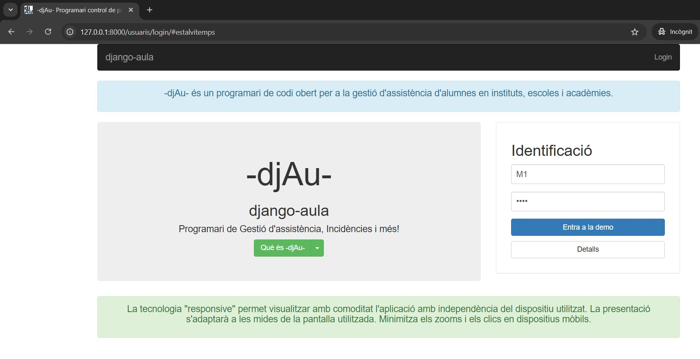
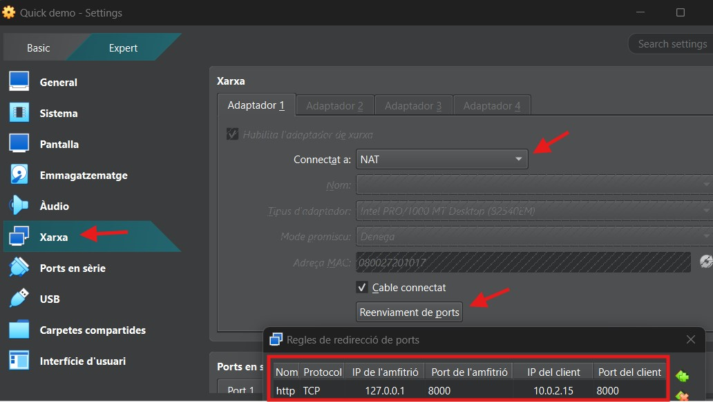
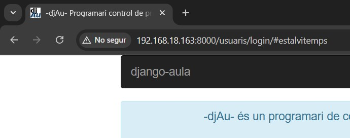
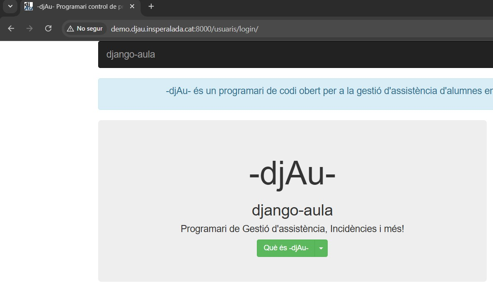

# Instal·ació manual de la Demo de Django-Aula

Aquesta guia ofereix les **instruccions per instal·lar manualment una instància d'un entornt de prova (Demo) de Django-Aula** amb un conjunt de dades fictícies (usuaris, professors i horaris) per tal de provar-ne les funcionalitats.

Aquest mètode està dissenyat per a mostrar el funcionament de l'aplicatiu als centres educatius que el vulguin implantar.

En resum, en aquesta guia es cobreix la instal·lació de la Demo en:
- Una **màquina aïllada de cap xarxa local** o exterior.
- Una **màquina virtualitzada** (guest) **configurada amb l'amfitriona** (host) amb ***xarxa-NAT*** aïllada de cap xarxa, només **accessible des de là màquina anfitriona**.
- Una **màquina virtualitzada** (guest) **configurada amb l'amfitriona** (host) amb ***xarxa-BRIDGE-pont*, integrada a la xarxa local com un equip més**.
- Un **servidor privat virtual (VPS)** en internet, **accessible des de qualsevol dispositiu connectat a internet**. 

---

# Ìndex

- [1. Requisits de Servidor](#id1)
- [2. Usuaris que es crean en la Demo i les seves credencials](#id2)
- [3. Instruccions generals d'instal·lació](#id3)
  * [3.1 Preparació de l'Entorn](#id31)
  * [3.2 Clonació del repositorio i Instal·lació de l'Aplicació](#id32)
  * [3.3 Creació de Dades per la Demo](#id33)
  * [3.4 Execució del servidor local de Django](#id34)
  * [3.5. Accés a la Demo amb Entorn Gràfic (Màquina Local)](#id35)
- [4. Accedir des d'un altre ordinador a la màquina on s'ha instal·lat la Demo](#id4)
  * [4.1 Màquina virtual creada amb VirtualBox i configurada amb xarxa NAT](#id41)
    + [4.1.1 Configuració de Redirecció de Ports de la màquina virtual (Host)](#id411)
    + [4.1.2 Addició de la llista ALLOWED_HOSTS de la Demo](#id412)
  * [4.2 Màquina virtual creada amb VirtualBox i configurada amb xarxa BRIDGE (pont)](#id42)
    + [Opcional - Aconseguir una IP Estàtica](#id-ip-estatica)
  * [4.3 Instal·lació de la Demo en un servidor públic amb accés extern (VPS)](#id43)
  * [4.4 Resum de les modificacions de la llista *ALLOWED_HOSTS* de l'arxiu *demo.py*](#id44)
- [5 Mantenir l'execucíó indefinida en el temps del servidor de Demostració](#id5)


---
<a name="id1"></a>
## 1. Requisits de Servidor 

* **Sistema Operatiu:** Ubuntu Server 22.04 LTS o Debian 13.
* **Accés:** Es requereix un usuari amb accés a "sudo".
**[Documentació per crear un nou usuari amb permisos de "sudo"](../ajuda-install/usuari_sudo.md)**

<a name="id2"></a>
## 2. Usuaris que es crean en la Demo i les seves credencials

Els usuaris de prova creats en el procés d'instal·lació tenen les següents credencials:

| Rol | Usuaris |
| :--- | :--- |
| **Professors** | "M0 ,M5 ,T0 ,T1 ,T3" |
| **Tutors** | "M2 ,M3 ,M4 ,M7 ,T2 ,T4 ,T5" |
| **Direcció** | "M1 ,M6, T1" |
| **Alumnat rang** | "almn1 - almn229" |

**Notes Importants sobre la Demo**

- **Contrasenya única**: Tots els usuaris de prova (Professors, Tutors, Direcció) utilitzen la contrasenya: **djAu**.
- Actualització de Dades: La base de dades de la Demo es refà automàticament a cada hora amb dades generades de manera aleatòria.
- Cookies: Aquest programari utilitza cookies estrictament per al manteniment de la sessió.

---
<a name="id3"></a>
## 3. Instruccions d'Instal·lació

Aquestes comandes es poden executar en un entorn Linux, preferiblement Debian 13 o Ubuntu Server 24.04 LTS o superior.

<a name="id31"></a>
### 3.1 Preparació de l'Entorn

Des del directori principal de l'usuari instal·lador cal instal·lar les dependències bàsiques necessàries del sistema:

```bash
sudo apt update && sudo apt install python3 python3-venv python3-dev git
```
Dependències per a lxml (necessari per a l'anàlisi d'XML i HTML):
```bash
sudo apt install python3-lxml python3-libxml2 libxml2-dev libxslt-dev lib32z1-dev
```
Llibreries gràfiques (necessàries en alguns entorns de desenvolupament):
```bash
sudo apt install libgl1 libglib2.0-0t64
```

<a name="id32"></a>
### 3.2 Clonació del repositorio i Instal·lació de l'Aplicació

Es recomana que la Demo de Django-Aula es posi a un directori que tingui un nom que no deixi dubtes, per exemple `demo-djau`.

Per fer-ho cal clonar el repositori en aquest directori i ho es pot fer des del mateix directori principal de l'usuari instal·lador:

```bash
git clone --single-branch --branch master https://github.com/ctrl-alt-d/django-aula.git demo-djau
cd demo-djau
```

Crear i activar l'entorn virtual:

```bash
python3 -m venv venv
source venv/bin/activate
```
En aquest moment s'hauria de veure com s'activa l'entorn virtual (venv) i el nomde l'usuari i el de la màquina. Quelcom similar a:
> (venv) djau@djau:~/demo-djau$

Si es veu `(venv)` anem pel bon camí i es poden nstal·lar les dependències de Python:
```bash
pip3 install -r requirements.txt
```
<a name="id33"></a>
### 3.3 Creació de Dades per la Demo

Un cop ha finalitat la instal·lació de la Demo, cal executar un script que crea les dades de demostració (professors, alumnes, horaris) i inicia el servidor de desenvolupament incorporat:

```bash
./scripts/create_demo_data.sh
```
<a name="id34"></a>
### 3.4 Execució del servidor local de Django

El servidor local de Django no està pensat per servir l'aplicació real de Django-Aula sinó per fer proves o pel desenvolupament de l'aplicatiu. No obstant és perfecte per servir la Demo, no cal més.

Ara bé, la manera d'iniciar el servidor canvia en funció del tipus de màquina on l'hàgim instal·lat. **Si estem en una màquina aïllada de cap xarxa però que diposa d'entorn gràfic amb un navegador diponible**, cal escriure:

```bash
python manage.py runserver
```

Un cop executat *python manage.py runserver* dins l'entorn virtual (venv) s'ha de poder veure quelcom similar a:

```text
(venv) djau@djau:~/demo-djau$ python manage.py runserver
Watching for file changes with StatReloader
Performing system checks...

System check identified no issues (0 silenced).
d'octubre 30, 2025 - 02:27:21
Django version 5.1.13, using settings 'aula.settings'
Starting development server at http://127.0.0.1:8000/
Quit the server with CONTROL-C.
```

Aquest missate indica que tenim un servidor local en proves en correcte funcionament accessible només des de la màquina on s'ha instal·lat la Demo.

<a name="id35"></a>
### 3.5. Accés a la Demo amb Entorn Gràfic (Màquina Local)

Com s'explica a la secció anterior, quan s'executa la comanda *python manage.py runserver* l'aplicació es posa en marxa a l'adreça local del servidor: *http://127.0.0.1:8000*.

Si la Demo s'ha instal·lat en un ordinador, o a una màquina virtual, que disposa d'un **escriptori gràfic i un navegador web** podreu accedir-hi directament obrint el navegador i anant a:

**http://127.0.0.1:8000**



<a name="id4"></a>
## 4. Accedir des d'un altre ordinador a la màquina on s'ha instal·lat la Demo

Si intenteu accedir a la Demo des d'una màquina on no s'hagi instal·lat la Demo no podreu accedir amb la IP "127.0.0.1"

La primera acció és detenir el servidor local, si l'havíem engegat i **canviar la forma d'executar el servior local** de desenvolupament **específicant una IP diferent**.

Execució del servidor amb accés extern:
```bash
python manage.py runserver 0.0.0.0:8000
```
La sortida que veurem serà similar a la vista anteriorment:

```text
(venv) djau@djau:~/demo-djau$ python manage.py runserver 0.0.0.0:8000
Watching for file changes with StatReloader
Performing system checks...

System check identified no issues (0 silenced).
d'octubre 30, 2025 - 02:27:21
Django version 5.1.13, using settings 'aula.settings'
Starting development server at http://0.0.0.0:8000/
```

Engegant el servidor local d'aquesta manera posibilita servir la Demo en qualsevol Ip que estigui configurada en la llista "ALLOWED_HOSTS".

**Caldrà accedir l'arxiu `demo.py`**, que es troba al directori */aula/settings_dir* i afegir la llista segons el cas que es tingui i ques detalla a continuació. 

```bash
nano aula/settings_dir/demo.py
```

<a name="id41"></a>
### 4.1 Màquina virtual creada amb VirtualBox i configurada amb xarxa NAT

Si utilitzeu una màquina virtual amb configuració de xarxa **NAT**, heu de configurar una redirecció de ports als paràmetres de xarxa per tal que redirigeixi el trànsit del *host* (màquina anfitriona) al *guest* (màquina virtual):

<a name="id411"></a>
#### 4.1.1 Configuració de Redirecció de Ports de la màquina virtual (Host)

| Camp | Valor |
| :--- | :--- |
| **Nom** | "http" |
| **IP Host** | "127.0.0.1" |
| **Port Host** | "8000" |
| **IP Guest** | "10.0.2.15" (Típicament però cal comprobar-ho dins la màquina virtual amb `ip a`) |
| **Port Guest** | "8000" |



<a name="id412"></a>
#### 4.1.2 Addició de la llista ALLOWED_HOSTS de la Demo

Per que la Demo respongui després de fer la redirecció de ports als paràmetres de la xarxa NAT de virtualBox, cal editar el fitxer `demo.py` de configuració de Django i afegir l'adreça IP des de la qual accedireu i que s'ha definit en la redirecció de ports:

**Cal afegir la variable "ALLOWED_HOSTS"** dins l'arxiu `demo.py`.

Busqueu la línia "ALLOWED_HOSTS = []" i afegiu l'adreça del host "ALLOWED_HOSTS = ['127.0.0.1']"

Obriu un navegador en la màquina on s'ha instal·lat VirtualBox i podreu escriure:
**http://127.0.0.1:8000**

<a name="id42"></a>
### 4.2 Màquina virtual creada amb VirtualBox i configurada amb xarxa BRIDGE (pont)

Si es vol que la màquina virtual tingui la seva pròpia adreça IP, donada pel gestor DHCP de la xarxa interna local, es pot seleccionar el paràmetre `bridge` en comptes de `NAT`.

Si s'escriu la comanda `IP a` s'obté l'adreça IP de la màquina virtual creada (guest).


>**1:** lo: mtu 65536 qdisc noqueue state UNKNOWN group default qlen 1000  
link/loopback 00:00:00:00:00:00 brd 00:00:00:00:00:00  
inet 127.0.0.1/8 scope host lo  
valid_lft forever preferred_lft forever  
inet6 ::1/128 scope host noprefixroute  
valid_lft forever preferred_lft forever  
**2:** **enp0s3**: mtu 1500 qdisc fq_codel state UP group default qlen 1000  
link/ether 08:00:27:20:10:17 brd ff:ff:ff:ff:ff:ff  
altname enx080027201017  
inet **192.168.18.163**/24 brd 192.168.18.255 scope global dynamic noprefixroute enp0s3  
valid_lft 3371sec preferred_lft 2921sec  
inet6 fe80::350b:3ecd:ef4:a9b5/64 scope link dadfailed tentative  
valid_lft forever preferred_lft forever  


**Cal afegir la variable "ALLOWED_HOSTS"** dins l'arxiu `demo.py` afegint l'adreça de la màquina *host* `ALLOWED_HOSTS = ['127.0.0.1', 'IP_DEL_GUEST']`

En el cas d'exemple que es mostra en aquestes instruccions es pot veure l'IP a afegir en el text en negreta anterior: `ALLOWED_HOSTS = ['127.0.0.1', '192.168.18.163']`

Ara ja es pot obrir un navegador en la màquina anfitriona (host) on s'ha instal·lat VirtualBox i es pot escriure:
**http://192.168.18.163:8000**



<a name="id-ip-estatica"></a>
#### Opcional - Aconseguir una IP Estàtica

**Atenció: La IP de la màquina virtual pot canviar quan s'apaga i es torna a engegar** perquè l'IP de la maquina Demo l'atorga el sistema DHCP de la xarxa interna, que entrega adreces IP a les màquines de forma variable, és a dir, no sempre té per què tenir la mateixa IP.

**Per mantenir la IP de forma estàtica** l'únic sistema que ha permés fixar l'IP ha sigut l'eina `Netplan` i les instruccions les podeuu trobar documentades al blog de [voidnull.es](https://voidnull.es/netplan-configura-tu-red-de-forma-sencilla-con-yaml/)

Les passes a seguir són les següents:

**1 - Instal·lar netplan**
```bash
sudo apt install netplan.io
```
**2 - Editar el arxiu de configuració en format `yaml`**
```bash
sudo nano /etc/netplan/01-netcfg.yaml
```
**3 - Crear l'arxiu en format `yaml` amb la configuració per a la IP estàtica que es vol mantenir fixa**.

A l'exemple següent es mostra l'adreça IP del meu Gateway (Router) i estic definint com IP estàtica aquella que en un principi el servidor DNS de la meva xarxa local ja havia assignat a la màquina Demo.

```yaml
network:
version: 2
renderer: networkd
ethernets:
enp0s3:
dhcp4: no
addresses: [192.168.18.163/24] # IP estàtica que es vol configurar i màscara
routes:
- to: default
via: 192.168.18.1 # Gateway (IP del router)
nameservers:
addresses: [192.168.18.1, 8.8.8.8] # IPs de DNS
```

**4 - Aplicar els permisos corresponents a l'arxiu `yaml`**

```bash
sudo chmod 600 /etc/netplan/01-netcfg.yaml
```

**5 - Habilitar i Iniciar el gestor de xarxes de Netplan, el servei `systemd-networkd`, i aplicar canvis**.

Es pot reiniciar també el sistema i comprobar, amb `IP a`, que es té l'adreça configurada o que s'en té una de nova si s'ha decidit canviar-la

```bash
sudo systemctl enable systemd-networkd
sudo systemctl start systemd-networkd
```

En aquest moment, si hi havia una connexió SSH oberta s'haurà perdut si s'ha canviat l'IP que es tenia per una altra d'estàtica nova, difererent de l'anterior.

Cal aplicar la configuració de Netplan:

```bash
sudo netplan apply
```

Ara ja es disposa de l'IP estàtica. Es pot comprovar amb `ip a` i reiniciant la màquina virtual Demo.

<a name="id43"></a>
### 4.3 Instal·lació de la Demo en un servidor públic amb accés extern (VPS)

Tot servidor a internet té una IP pública i és convenient definir un domini o subdomini per accedir-hi. Consulteu el document [Registres DNS](../ajuda-install/registres_dns.md) si no recordeu com fer-ho. En aquest cas, s'han creat dos subdominis que apunten a l'IP pública del servidor VPS:
> demo.djau.domini.cat  
> www.demo.djau.domini.cat

A més a més ha calgut buscar entre les opcions del panel de control del proveïdor del VPS allò que en diuen *Polítiques de Firewall* per tal d'obrir el port 8000, que és el port que normlment s'obre amb el servidor web per a proves de Django.

El procés per instal·lar la Demo és el definit a l'apartat 1.1 i 1.2 i a l'hora d'aixecar el servidor de proves, si es vol anar sobre segur, cal fer servir (dins l'entorn venv):
```bash
python manage.py runserver 0.0.0.0:8000
```

Ara bé, cal editar l'arxiu demo.py:
```bash
nano aula/settings_dir/demo.py
```
I afegir la llista ALLOWED_HOSTS, de tal manera que cal afegir els dos subdominis creats i, a més a més, l'IP pública del servidor VPS.

`ALLOWED_HOSTS = ['demo.djau.domini.cat', 'www.demo.djau.domini.cat', '127.0.0.1', 'IP_PúBLICA_VPS',]`

De fet, el servidor de proves de Django es pot aixecar perfectament posant l'IP pública del VPS, en comptes de 0.0.0.0
```bash
python manage.py runserver IP_PúBLICA_VPS:8000
```

D'aquesta senzilla manera, sense haver d'instal·lar un servidor web per producció, com el servidor Apache, que és el que es fa servir oficialment per la versió de l'aplicatiu per producció, es pot servir la versió Demo de l'aplicatiu a tot aquell que vulgui veure com funciona des de qualsevol ordinador a internet, simplement:

>http://IP_DEL_TEU_SERVIDOR:8000  
http://SUBDOMINI:8000



<a name="id44"></a>
### 4.4 Resum de les modificacions de la llista *ALLOWED_HOSTS* de l'arxiu *demo.py*

| Entorn | Configuració de "ALLOWED_HOSTS" |
| :--- | :--- |
| **Màquina Virtual (VirtualBox NAT)** | `ALLOWED_HOSTS = ['127.0.0.1']` |
| **Xarxa Interna Local** | `ALLOWED_HOSTS = ['127.0.0.1', 'IP_DEL_GUEST']` |
| **VPS (Accés per Domini)** | `ALLOWED_HOSTS = ['127.0.0.1', 'IP_PúBLICA_VPS', 'demo.djau.domini.cat', 'www.demo.djau.domini.cat',]` |

<a name="id5"></a>
## 5 Mantenir l'execucíó indefinida en el temps del servidor de Demostració

Normalmente s'accedeix a la màquina on s'ha instal·lat la Demo des d'un terminal de la nostra màquina personal, amb Linux o Windows, mitjançant el protocol SSH.

Ara bé, el servidor de proves no està indefinidament funcionant. De fet, **quan es tanca la connexió SSH el procés del servidor també es tanca** (*python manage.py runserver*), i deixa de funcionar fent que **la Demo de Django-Aula ja no sigui accessible**.

---

**Instruccions per l'execucíó indefinida en el temps del servidor de Demostració**

Si es vol que la Demo estigui disponible el temps que necessitem, mentre no s'apagui físicament el servidor que l'està executant, la manera d'executar *python manage.py runserver* canvia. Ara cal engegar el servidor *runserver* de la següent manera:

```bash
nohup python -u manage.py runserver IP_PúBLICA_VPS:8000 &
```

* **nohup** desconnecta el procés de la sessió ssh (encara que si fem *ctrl-c* el procés s'aturarà igualment).
* **-u** indica a python que s'executi en mode sense memòria intermèdia per no perdre cap sortida del procés.
* Es pot afegir **&** després de l'ordre per empènyer el procés immediatament a segon pla i recuperar el shell, mantenint l'ús de *ctrl-c*.

Per tancar el servidor *runserver* de python hi ha dues opcions:
1. Es pot reiniciar el servidor
2. Es pot buscar l'ID del procés i detenir-lo.

Per explorar la segona opció cal buscar l'identificador del procés i *matar-lo*. El procés seria el següent:

1 - Mostrar totes les ordres python en execució:
```bash
ps aux | grep python
```
2 - Trobar l'ID del procés de l'ordre que es vol aturar i després aturar-lo:
```bash
kill
```
on cal substituir amb l'ID del procés obtinguda mitjançant `ps aux`.
