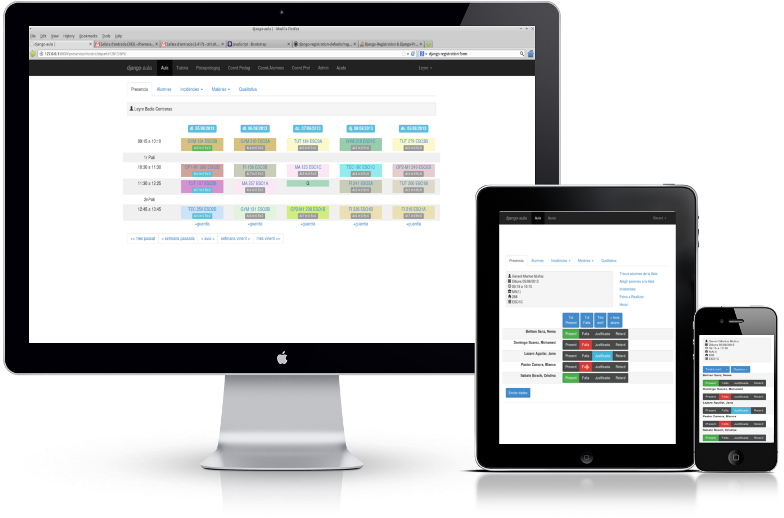

# Django-Aula

**Django Aula** es una aplicación desarrollada en **Python** con el framework [**Django**](https://www.djangoproject.com/), que permite a un centro educativo gestionar de forma sencilla la presencia e incidencias de sus alumnos y mucho mas. 

Este Libro contendrá toda la información necesaria para desplegar la aplicación [django-aula](https://github.com/ctrl-alt-d/django-aula) en cualquier centro educativo de Cataluña, el libro puede contener información errónea ya que el proyecto sigue en desarrollo, se intentara que este siempre lo mas actualizado posible.

El Proyecto es Open-source, y aquí se encuentra su repositorio Git: [https://github.com/ctrl-alt-d/django-aula](https://github.com/ctrl-alt-d/django-aula).

# Table of contents

* [Django-Aula](README.md)
* [Características](caracteristicas.md)
* [Funcionalidades](funcionalidades.md)
* [Instalación](instalacion-2/README.md)
  * [Instalación en Ubuntu Server 20.04/22.04 LTS](instalacion-2/instalacion.md)
* [Manual del Administrador](manual-de-uso/README.md)
  * [Primer Inicio](manual-de-uso/primer-inicio.md)
  * [Carga Inicial de datos](manual-de-uso/carga-inicial-de-datos/README.md)
    * [Configurar Franjas Horarias y Dias de la semana](manual-de-uso/carga-inicial-de-datos/configurar-franjas-y-dias-semana.md)
    * [Configurar Estados de Asistencia y Tipos de Asignatura](manual-de-uso/carga-inicial-de-datos/configurar-estados-de-asistencia-y-tipos-de-asignatura.md)
    * [Carga De Niveles, Cursos y Grupos](manual-de-uso/carga-inicial-de-datos/creacion-de-niveles-cursos-y-grupos.md)
    * [Carga de Alumnos Fichero SAGA](manual-de-uso/carga-inicial-de-datos/carga-de-alumnos-fichero-saga.md)
    * [Carga Profesores y Franjas Horarias](manual-de-uso/carga-inicial-de-datos/carga-profesores-y-franjas-horarias.md)
    * [Carga de Horarios, Aulas y Asignaturas](manual-de-uso/carga-inicial-de-datos/carga-de-horarios-aulas-y-asignaturas.md)
    * [Tareas Recomendables](manual-de-uso/carga-inicial-de-datos/tareas-recomendables.md)
    * [Creación del Horario](manual-de-uso/carga-inicial-de-datos/creacion-del-horario.md)
  * [Actualización a última versión](manual-de-uso/actualitza.md)
  * [Inicialización a final de curso](manual-de-uso/inicialitza.md)
  * [Cuotas](manual-de-uso/quotes.md)
  * [Matrícula online](manual-de-uso/matricula.md)
* [Anexos](anexos/README.md)
  * [Exportación Saga](anexos/exportacion-saga.md)
  * [Importar alumnes Saga i Esfer@](../installacio/TutorialALUMNES_SAGA-ESFER@_a_DJAU.pdf)
  * [Importar alumnes sense grup assignat](../installacio/IMPORTAR_A_DJAUsense_curs_actualitzat.pdf)
  * [Pagaments de sortides](../installacio/Tutorial%20pagament%20activitats%20on-line.pdf)
  * [Importar horaris Kronowin](../installacio/exportacio-kronowin.pdf)
  * [Importar horaris Untis](../Wiki/manual-de-uso/carga-inicial-de-datos/README.md#para-untis)
* [Fork Django-Aula DAW Credito Sintesis](fork-django-aula-daw-credito-sintesis.md)

