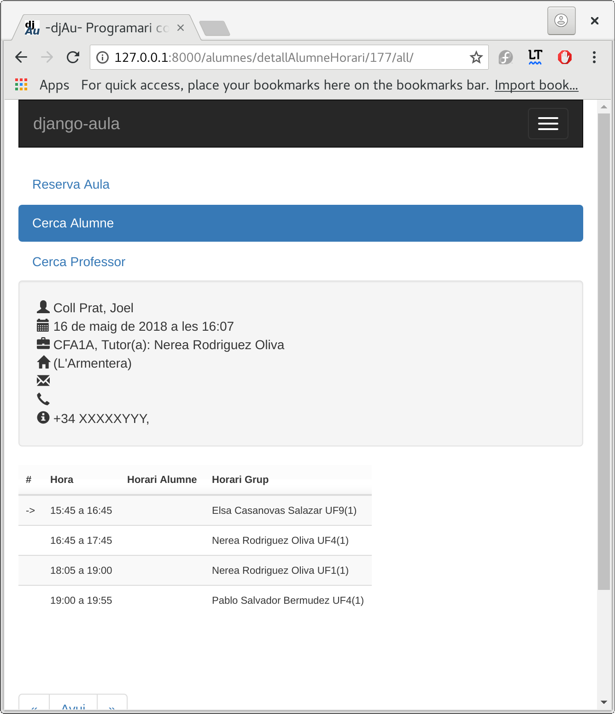

# Funcionalidades

### Presencia

* Pasar lista. 
* Posibilidad de copiar y/o rectificar la hora anterior.
* Reglas para no solapar las justificaciones entre tutores.
* No se puede pasar lista por error en clases posteriores.
* Permitir pasar lista como profesor de guardia.

### **Reserva de aulas**

* Gestión integrada acorde con las reservas de aulas.
* Prohibir reservar un aula donde haya programada una docencia.
* Un profesor puede cambiar de aula y  liberar la que tuviese reservada.

### **Incidencias y observaciones:**

El sistema permite diferenciar entre las incidencias y las observaciones, asimismo también se pueden crear otros tipos de incidencias, como por ejemplo, incidencias graves.

Cada tipo de incidencia puede tener sus propios mensajes, de modo que, en observaciones se pueden poner frases como:

* Hoy no ha hecho los deberes 
* Hay que felicitarlo por el gran trabajo que ha hecho hoy

y a incidencias se pueden preparar frases como:

* Estaba en el pasillo en vez de en su clase
* Molesta a los compañeros mientras hacemos clase

Permite al profesor poner  incidencias y observaciones a un Alumno,Varios o a toda una clase.

### **Expulsiones de aula**

Gestiona todo el proceso de expulsión de alumnos del aula, desde que el profesor de guardia recoge la expulsión hasta que el profesor que realiza la expulsión contacta con la familia.  

**Sanciones:**  
Permite gestionar las sanciones contempladas por las NOFC del centro, como por ejemplo expulsiones temporales del centro o incluso trabajos para la comunidad.

  
**Actuaciones:**  
Permite recoger las acciones que tutores y psicopedagogos realizan con los alumnos y sus familias.  
  
**Gestiones:**  
Buscador de profesores y alumnos.

### **Salidas y Actividades** 

· Gestión íntegra de las salidas y actividades.  
· Reúne desde fase de planificación y propuesta hasta la validación por parte del coordinador de actividades y jefe de estudios.  
· Compatible con Google Calendar para publicar las actividades del centro. Sincronizado con el control de presencia y con el portal de las familias.  
· Gestión de alumnos convocados pero no que no han asistido.  
· Impresión del código de barras referido al pago.

### 

### **Mensajería**

Sistema de mensajería para informar a los alumnos y sistema de mensajería interna.

### Herramientas de tutoría

Múltiples herramientas de tutoría, como el informe del alumno, la generación de notificaciones por absentismo y una herramienta para justificar las faltas de asistencia de forma fácil y rápida.

### E**valuación diagnóstica - Cualitativa**

Preparación y ejecución dinámica de evaluaciones cualitativas por niveles.

### **Portal abierto a las familias**

### Matrícula online

El Djau permite obtener los datos para realizar la [matrícula](manual-de-uso/matricula.md) de los alumnos. Las familias indican la información necesaria y pueden realizar los pagos con tarjeta.

Básicamente, hay tres tipos de gestión:

Confirmación de matrícula

&nbsp;&nbsp;&nbsp;&nbsp;Se utiliza para ESO y Bachillerato, las familias confirman que quieren continuar.

Matrícula nueva según preinscripción

&nbsp;&nbsp;&nbsp;&nbsp;Para los casos de alumnos nuevos que han tenido que hacer preinscripción.

Matrícula de continuidad sin preinscripción

&nbsp;&nbsp;&nbsp;&nbsp;Para alumnos actuales de ciclos que continúan sus estudios.

Este mecanismo no sustituye a la matrícula oficial.

&nbsp;
> Gracias a [@ctrl\_alt\_d](https://twitter.com/ctrl_alt_d) por la cesión de las imágenes.

