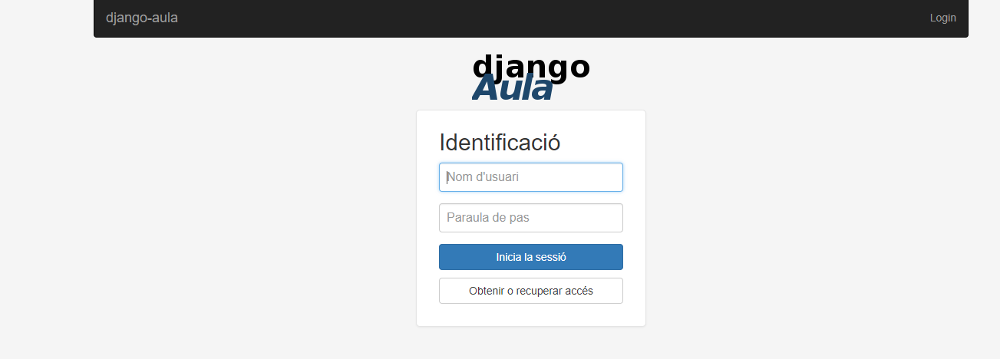

# Instalación en Ubuntu Server 20.04 LTS

> **Atención:**  Todas las instrucciones de este documento se deben ejecutar con permisos elevados

### Preparando el Entorno

El primer paso es preparar un entorno de desarrollo **[Python](https://www.python.org/)** en nuestro sistema, para ello instalamos los siguientes paquetes:

```bash
apt-get update
apt-get upgrade
apt-get install python3 python3-venv libxml2-dev libxslt-dev python3-lxml python3-libxml2 python3-dev lib32z1-dev git
```

Entre otras cosas se ha instalado el paquete **python-virtualenv** ya que la instalación la haremos sobre un entorno virtual de **Python**, si tienes curiosidad sobre esto, visita este [enlace](https://packaging.python.org/en/latest/guides/installing-using-pip-and-virtual-environments/).

Nos colocamos en el directorio donde instalaremos la aplicación y clonamos el repositorio del proyecto.

```bash
cd /opt && sudo git clone https://github.com/ctrl-alt-d/django-aula.git djau2022 
sudo chown -R :www-data djau2022  #opcionalmente se puede cambiar el propietario para no utilizar root.
cd djau2022
```


>Es recomendable que la carpeta contenga el año del curso, ya que la aplicación esta diseñada para ser instalada de nuevo en cada curso \(Decisión de diseño\).

>Una alternativa a instalar de nuevo en cada curso es la [inicialización](../manual-de-uso/inicialitza.md).


El siguiente paso es montar nuestro **entorno virtual Python** sobre la carpeta del proyecto, este comando creará un entorno virtual en un directorio llamado **venv**.

```text
djau@djau:/opt/djau2022#  python3 -m venv venv
```

Una vez creado el entorno virtual debemos activarlo, para ello ejecutamos:

```text
djau@djau:/opt/djau2022# source venv/bin/activate
```

Si todo ha ido bien el **[prompt](https://es.wikipedia.org/wiki/Prompt)** debería haber cambiado a algo parecido a:

**(venv) djau@djau:/opt/djau2022$**

Ahora que ya tenemos el entorno virtual el siguiente paso es instalar las dependencias del proyecto, para ello utilizaremos el gestor de dependencias **[pip3](https://es.wikipedia.org/wiki/Pip_%28administrador_de_paquetes%29)**.

```text
(venv) djau@djau:/opt/djau2022# pip3 install wheel
(venv) djau@djau:/opt/djau2022# pip3 install -r requirements.txt
```

### Instalación de Apache y Base de datos

Antes de seguir con la aplicación, instalaremos Apache  y el módulo [wsgi](https://en.wikipedia.org/wiki/Web_Server_Gateway_Interface) para que pueda servir nuestra aplicación Python a través de él.

Además instalaremos la base de datos que usará django-aula y su conector python correspondiente, se recomienda instalar la aplicación sobre postgresql pero también es posible hacerlo sobre Mysql.

**Postgresql  (recomenat):**

```bash
apt-get install apache2 libapache2-mod-wsgi-py3 python3-psycopg2 postgresql postgresql-server-dev-12
pip3 install wheel psycopg2
```

**Mysql (no recomenat):**

```bash
apt-get install apache2 libapache2-mod-wsgi-py3 python3-mysqldb mysql-server libmysqlclient-dev
pip3 install wheel mysqlclient
```

Una vez elegido el motor de base de datos, hay que crear la base de datos de la aplicación, y crear un usuario que la pueda administrar.


**Para Postgresql**

```text
sudo su postgres
psql
CREATE DATABASE djau2022;
CREATE USER djau2022 WITH PASSWORD 'XXXXXXXXXX';
GRANT ALL PRIVILEGES ON DATABASE djau2022 TO djau2022;
\q
exit
```

**Para Mysql**

```
sudo su
mysql
CREATE DATABASE djau2022 CHARACTER SET utf8;
CREATE USER 'djau2022'@'localhost' IDENTIFIED BY 'XXXXXXXX';
GRANT ALL PRIVILEGES ON djau2022.* TO 'djau2022'@'localhost';
USE djau2022;
SET default_storage_engine=INNODB;
QUIT
exit
```

### Configurando Private Storage

Hay información que la aplicación guarda en ficheros y que no debe estar en el servidor web. 
Actualmente las fotos de los alumnos.

Para ello hay que crear una carpeta donde guardar esa información.

```bash
mkdir -p /opt/djau-dades-privades-2022
chmod 770 /opt/djau-dades-privades-2022
chgrp www-data /opt/djau-dades-privades-2022 
```

En el siguiente apartado se configura la variable `PRIVATE_STORAGE_ROOT` con el path escogido.


### Configurando Aplicación

Django Aula tiene 3 archivos principales de configuración

* **`settings.py` (Aquí se encuentra la parametrización Custom de la app, no hay que tocar este fichero, sobreescribir los settings que se desee en `settings_local.py`) más [info](../../manuals/parametritzacions.txt)**.
* **`settings_local.py` (Aquí esta la configuración principal )**.
* **`wsgi.py` (Es el script que se encargará de levantar la aplicación, Apache utilizará este archivo para servir la app a través de él)**.

A continuación dejo una configuración válida para los 2 archivos citados anteriormente, simplemente copia, pega y adáptalo a tus necesidades.

Los archivos están comentados para entenderlos mejor.

**`/opt/djau2022/aula/settings_local.py"`**

```python
# This Python file uses the following encoding: utf-8
# Django settings for aula project.

from .settings_dir.common import *
from .settings import CUSTOM_PORTAL_FAMILIES_TUTORIAL

#En producción dejar en False
DEBUG = True

#Información del Centro
NOM_CENTRE = 'Centre de Demo'
LOCALITAT = u"Badia del Vallés"

#Per a fer importació de la preinscripció
CODI_CENTRE = u"00000000"

#URL Por donde contestará la aplicación (Cambiar schema a https si se activa el tráfico TSL)
URL_DJANGO_AULA = r'http://elteudomini.cat'

#HOSTS que tendrán acceso a la Aplicación (solo es necesario el servidor y sus alias)
#Puedes colocar direcciones en formato CIDR o dominios, tambien se aceptan Wildcards
ALLOWED_HOSTS = [ 'elteudomini.cat', '127.0.0.1', ]

ACCES_RESTRINGIT_A_GRUPS = None # ó be = ['direcció','administradors']  durante las pruebas

#Datos del usuario administrador
ADMINS = (
    ('admin', 'ui@mega.cracs.cat'),
)

#Configuracion del Correo Relay SMTP y IMAP de la Aplicación
EMAIL_HOST='smtp.gmail.com'
EMAIL_HOST_IMAP="imap.gmail.com"
EMAIL_HOST_USER='el-meu-centre@el-meu-centre.net'
EMAIL_HOST_PASSWORD='xxxx xxxx xxxx xxxx'
DEFAULT_FROM_EMAIL = 'El meu centre <no-reply@el-meu-centre.net>'
EMAIL_PORT=587
EMAIL_USE_TLS=True
SERVER_EMAIL='el-meu-centre@el-meu-centre.net'

EMAIL_BACKEND = 'django.core.mail.backends.smtp.EmailBackend'
# Per proves, envia a la consola
#EMAIL_BACKEND = 'django.core.mail.backends.console.EmailBackend' 

EMAIL_SUBJECT_PREFIX = '[DEMO AULA] '

#True si se activa el HTTPS
SESSION_COOKIE_SECURE=False

SESSION_EXPIRE_AT_BROWSER_CLOSE = True
CSRF_COOKIE_SECURE=False  #True si se activa el HTTPS

#Si se utiliza un árbol de predicción se define aquí:
location = lambda x: os.path.join(PROJECT_DIR, x)
BI_DIR = location('path_hasta_el_modelo')
__PREDICTION_TREE_TMP = os.path.join( BI_DIR, 'previsioPresencia.pmml' )
from lxml import etree
#PREDICTION_TREE = etree.parse( __PREDICTION_TREE_TMP )
PREDICTION_TREE = None

#Ruta donde almacenará los assets de la aplicación
STATICFILES_DIRS =  STATICFILES_DIRS
STATIC_ROOT= os.path.join(PROJECT_DIR,'static/')

#Comprime los assets estáticos de la app, False por defecto
COMPRESS_ENABLED = False

#Passphrase que usara la app para cifrar las credenciales
# changeit --> python manage.py generate_secret_key
SECRET_KEY = 'j*y^6816ynk5$phos1y*sf$)3o#m(1^u-j63k712keu4fjh$lc'

CUSTOM_RESERVES_API_KEY = 'sxxxxxxm'

#Componente que utilizará Django para serializar los objetos
SESSION_SERIALIZER='django.contrib.sessions.serializers.PickleSerializer'

# Path de datos privados
PRIVATE_STORAGE_ROOT ='/opt/djau-dades-privades-2022/'
CUSTOM_CODI_COMERÇ = 'xxxxxx'
CUSTOM_KEY_COMERÇ = 'xxxxxx'

#Configuración de la Base de datos
DATABASES = {
    'default': {
        'ENGINE': 'django.db.backends.sqlite3',
        'NAME': location( 'db.sqlite'),
        'USER': '',
        'PASSWORD': '',
        'HOST': '',
        'PORT': '',
        'ATOMIC_REQUESTS': True,
    }
}

# TermesICondicions (copiar els samples amb un altre nom i apuntar als nous fitxers)
DADES_FISCALS_FILE = location( r'../customising/TermesIcondicions/DADESFISCALS.sample' )
POLITICA_VENDA_FILE = location( r'../customising/TermesIcondicions/POLITICAVENDA.sample' )
#Fitxer de text amb les condicions de matrícula, es poden fer servir marques HTML.
CUSTOM_MODUL_MATRICULA_ACTIU = True
CONDICIONS_MATRICULA = location( r'../customising/TermesIcondicions/MATRICULA.sample' )

# S'ha de considerar si és volen fer servir els següents fitxers
#Fitxer de text amb l'avís sobre el tractament de dades personals, es poden fer servir marques HTML.
#Es mostra a la part inferior de les pantalles d'entrada de dades com la de "Canvi de paràmetres".
#INFORGPD = location( r'../customising/TermesIcondicions/INFORGPD.sample' )
#Els següents fitxers es fan servir en les condicions dels pagaments online
#Política de cookies.
#POLITICA_COOKIES = location( r'../customising/TermesIcondicions/POLITICACOOKIES.sample' )
#Informació sobre protecció de dades de caràcter personal.
#POLITICA_RGPD = location( r'../customising/TermesIcondicions/POLITICARGPD.sample' )

CUSTOM_MESSAGE_BENVINGUDA_FAMILIES = [ u"Aquest missatge ha estat enviat per un sistema automàtic. No responguis a aquest correu, el missatge no serà llegit per ningú.",
                     u"",
                     u"Benvolgut/da,",
                     u"",
                     u"És molt important que et donis d’alta de l’aplicació DjAu per tal que hi hagi una comunicació fluida entre el centre i les famílies.",
                     u"",
                     u"L’aplicació DjAu et permetrà fer un seguiment diari del teu fill/a. Hi trobaràs dades d'assistència, de disciplina, i observacions del professorat. També tindràs accés a informació i pagament d’activitats i sortides.",
                     u"",
                     u"Segueix les instruccions per a donar-te d'alta al DjAu:",
                     u"",
                     u" 1.- Entra a {0}".format(URL_DJANGO_AULA),
                     u" 2.- Clica l'enllaç 'Obtenir o recuperar accés'. ",
                     u" 3.- Escriu l’adreça de correu electrònic on has rebut aquest correu. ",
                     u" 4.- Clica el botó Enviar.",
                     u" 5.- Consulta el correu electrònic on hi trobaràs el teu nom d’usuari i un missatge amb les instruccions per completar el procés d'accés al Djau.",
                     u"",
                     u"Per qualsevol dubte/notificació posa't en contacte amb el tutor/a.",
                     u"",
                     u"Cordialment,",
                     u"",
                     NOM_CENTRE,
                     u"",
                     u"{0}".format( CUSTOM_PORTAL_FAMILIES_TUTORIAL ),
                     ]

```

**`/opt/djau2022/aula/wsgi.py`**

```python
import os

os.environ['DJANGO_SETTINGS_MODULE'] = 'aula.settings'

from django.core.wsgi import get_wsgi_application
application = get_wsgi_application()

```

Con los archivos de configuración listos es momento de [mapear](https://docs.djangoproject.com/en/4.0/topics/migrations/) los modelos del proyecto django hacia nuestra base de datos, es decir vamos a crear las tablas de la aplicación, empezaremos a ver cómo se crean todas las tablas, no debe dar ningún error.

```text
djau@djau:/opt/djau2022# source venv/bin/activate
(venv) djau@djau:/opt/djau2022# python manage.py migrate
```

Ahora que tenemos las tablas creadas, hay que llenarlas con algunos datos esenciales para que la app arranque, para ello ejecutamos el siguiente script:

```text
(venv) djau@djau:/opt/djau2022# bash scripts/fixtures.sh
```


>Es muy posible que dé algún Warning, simplemente ignóralo, recuerda que esta aplicación aún está en desarrollo.


Ahora debemos crear un usuario administrador que pueda gestionar la app, para ello ejecutamos:

```text
djau@djau:/opt/djau2022# source venv/bin/activate
(venv) djau@djau:/opt/djau2022# python manage.py createsuperuser
```

Nos pedirá el nombre del usuario y su contraseña \(en este ejemplo lo he llamado **admin**\).

Para que nuestro administrador pueda iniciar sesión en la aplicación, debe de estar en el grupo de **dirección,profesores y profesional** de la base de datos, para ello abrimos una shell de django y escribimos línea a línea lo siguiente:

```text
djau@djau:/opt/djau2022# source venv/bin/activate
(venv) djau@djau:/opt/djau2022# python manage.py shell

from django.contrib.auth.models import User, Group
g1, _ = Group.objects.get_or_create( name = 'direcció' )
g2, _ = Group.objects.get_or_create( name = 'professors' )
g3, _ = Group.objects.get_or_create( name = 'professional' )
a = User.objects.get( username = 'admin' )
a.groups.set( [ g1,g2,g3 ] )
a.save()
quit()
```

Como paso final de configuración, vamos a juntar todo el contenido estático \(js,css..etc\) del proyecto a un solo directorio, para que la instalación sea mas limpia. Más información sobre el contenido estático en django [aqui](https://docs.djangoproject.com/en/4.0/howto/static-files/).

```text
djau@djau:/opt/djau2022# source venv/bin/activate
(venv) djau@djau:/opt/djau2022# python manage.py collectstatic
```

Esto generará un directorio llamado **static** donde se alojarán todos los assets de la aplicación.

### Configurando Apache para que sirva la app

Si se ha seguido al pie de la letra este manual, simplemente hay que crear un nuevo Virtualhost en Apache que sirva nuestra app por el protocolo WSGI.

Es importante comprobar que tenemos la configuración regional correcta.
Verificación:

```bash
locale -a
```

Generación del locale adecuado para nuestro caso, por ejemplo:

```bash
sudo locale-gen ca_ES.utf8
```

El primer escenario es para servir la app por el puerto 80 \(http\),

El segundo escenario sirve la app por SSL \(https\)

**Primer Escenario `/etc/apache2/sites-available/djau.conf`**

>El djau debe funcionar en modo `https`, esta configuración corresponde a `http`. Una vez comprobado el correcto funcionamiento lo más adecuado es redireccionar al servidor `https`:

```apache

<VirtualHost *:80>
        ServerAdmin juan@xtec.cat
        ServerName el_teu_domini.cat

        WSGIDaemonProcess djau python-home=/opt/djau2022/venv python-path=/opt/djau2022 \
			locale="ca_ES.utf8"
        WSGIProcessGroup djau
        WSGIApplicationGroup %{GLOBAL}
        WSGIScriptAlias / /opt/djau2022/aula/wsgi.py 
        
        #Alias para contenido estatico de la app
        
        Alias /site-css/admin /opt/djau2022/aula/static/admin/
        Alias /site-css /opt/djau2022/aula/static/

        ErrorLog /var/log/apache2/djau_error.log

        #Dando acceso a apache a los directorios de la app
        <Directory /opt/djau2022/aula>
                <Files wsgi.py>
                        Require all granted
                </Files>
        </Directory>

        <Directory /opt/djau2022/aula/static/>
                Require all granted
        </Directory>


        <Directory /opt/djau2022/aula/static/admin/>
                Require all granted
        </Directory>

        LogLevel info

        CustomLog /var/log/apache2/djau_access.log combined

        BrowserMatch ".*MSIE.*" \
                nokeepalive ssl-unclean-shutdown \
                downgrade-1.0 force-response-1.0

</VirtualHost>
```

>Ejemplo de redirección hacia `https`:

```apache
<VirtualHost *:80>
	ServerName el_teu_domini.cat
	RedirectMatch permanent ^(.*)$ https://el_teu_domini.cat/$1
</VirtualHost>
```

**Segundo Escenario `/etc/apache2/sites-available/djau_ssl.conf`**

```apache
#Recuerda cambiar lo necesario en el archivo /opt/djau2022/aula/settings_local.py
#Para que la app pueda ir por SSL (TLS)
#Tambien activa si no lo esta el modulo ssl:
# a2enmod ssl

<VirtualHost *:443>

        ServerAdmin juan@xtec.cat
        ServerName el_teu_domini.cat

        WSGIDaemonProcess djau python-home=/opt/djau2022/venv python-path=/opt/djau2022 \
			locale="ca_ES.utf8"
        WSGIProcessGroup djau
        WSGIApplicationGroup %{GLOBAL}
        WSGIScriptAlias / /opt/djau2022/aula/wsgi.py 
        
        #Alias para contenido estatico de la app
        
        Alias /site-css/admin /opt/djau2022/aula/static/admin/
        Alias /site-css /opt/djau2022/aula/static/

        ErrorLog /var/log/apache2/djau_ssl_error.log

        #Dando acceso a apache a los directorios de la app
        <Directory /opt/djau2022/aula>
                <Files wsgi.py>
                        Require all granted
                </Files>
        </Directory>

        <Directory /opt/djau2022/aula/static/>
                Require all granted
        </Directory>


        <Directory /opt/djau2022/aula/static/admin/>
                Require all granted
        </Directory>

        #SSL Config#########################

        # Generar SelfSignedCertificate
        # openssl req -x509 -nodes -days 365 -newkey rsa:2048 -keyout /etc/ssl/private/badia-selfsigned.key -out /etc/ssl/certs/badia-selfsigned.crt

        SSLEngine on
        SSLCertificateFile /etc/ssl/certs/badia-selfsigned.crt
        SSLCertificateKeyFile /etc/ssl/private/badia-selfsigned.key
        LogLevel warn

        #SSL Config#######################

        LogLevel info

        CustomLog /var/log/apache2/djau_ssl_access.log combined

        BrowserMatch ".*MSIE.*" \
                nokeepalive ssl-unclean-shutdown \
                downgrade-1.0 force-response-1.0

</VirtualHost>

```

Una vez creado el VirtualHost,  deshabilitamos el Vhost que trae por defecto Apache para que no nos de problemas y reiniciamos el servidor web

```text
djau@djau:# a2dissite 000-default.conf  # podría tener un nombre diferente
djau@djau:# a2ensite djau.conf
djau@djau:# a2ensite djau_ssl.conf
djau@djau:# systemctl reload apache2
```

Si todo ha ido bien, la aplicación ya esta desplegada en producción , si accedemos a su dominio en mi caso "http://el_teu_domini.cat" o "https://el_teu_domini.cat" según escenario, deberá abrirse el Panel de Login de Django-Aula. **¡Felicidades!**



### Post Instalación

Es recomendable programar los siguientes Scripts en **Cron:**

**CronTab**

```text
0,20,40 * * * * su - djau /opt/djau2022/backup-bdd-2019.sh
42 8,9,10,11,12,13,14,15,16,17,18,19,20,21 * * 1,2,3,4,5 su - www-data -c "/opt/djau2022/scripts/notifica_families.sh" >> /opt/django/log/notifica_families_`/bin/date +\%Y_\%m_\%d`.log 2>&1
41 00 * * 1,2,3,4,5 su - www-data -c "/opt/djau2022/scripts/preescriu_incidencies.sh" >> /opt/django/log/prescriu_incidencies_`/bin/date +\%Y_\%m_\%d`.log 2>&1
20,50 * * * 1,2,3,4,5 su - www-data -c "/opt/djau2022/scripts/sortides_sincronitza_presencia.sh" >>  /opt/django/log/sincro_presencia_`/bin/date +\%Y_\%m_\%d`.log 2>&1
```


>Están creados todos los scripts menos el siguiente, créalo y dale permisos de ejecución.

**/opt/django/backup-bdd-2019.sh**

```bash
#!/bin/bash
ara=`/bin/date +%Y%m%d%H%M`
hora=`/bin/date +%H`
dia=`/bin/date +%d`
mes=`/bin/date +%Y%m`
directori="/opt/django/djauBK/"
copia="${directori}bdd-ara-${ara}.sql"
extensio=".bz2"
mkdir $directori
/usr/bin/pg_dump -U djau2022 djau2022 > $copia
/bin/bzip2 $copia
cat "${copia}${extensio}" > "${directori}bdd-hora-${hora}.sql${extensio}" 
cat "${copia}${extensio}" > "${directori}bdd-dia-${dia}.sql${extensio}" 
cat "${copia}${extensio}" > "${directori}bdd-mes-${mes}.sql${extensio}" 
rm $copia${extensio}
```

