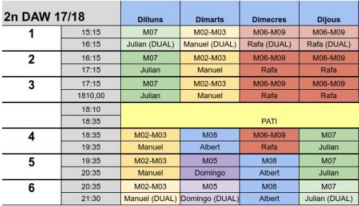
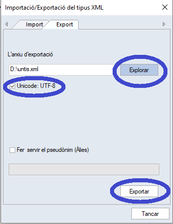

# Carga Inicial de datos

## Introducción

Se puede decir que este es el paso mas crítico de la puesta en marcha de Django-Aula, es en este paso donde deberemos cargar todos los alumnos, profesores, aulas, asignaturas, grupos, horarios...

La aplicación tiene una serie de módulos para importar todos estos datos  desde diferentes fuentes, esto permite una carga masiva de datos, una carga manual de datos es teóricamente posible pero el proceso se vuelve titánico y nada recomendable.

Si no sabes mucho del tema te preguntaras una cosa, "¿De donde obtengo todos esos datos en un CSV, XML, XLSX, ... ?"

Para la importación masiva de **alumnos** django-aula reconoce el formato de salida que ofrece el software **SAGA** y **Esfera**.

SAGA y Esfera son software ofrecido por la **La Generalitat de Cataluña** que permite gestionar y centralizar a nivel Autonómico la historia académica de un Alumno y cualquier centro educativo tiene acceso a este portal y a sus alumnos.

Una de las exportaciones de SAGA permite obtener una serie de alumnos junto a toda su información, su aspecto es el siguiente:

```text
"#","00_IDENTIFICADOR DE L'ALUMNE/A","01_NOM","02_DATA NAIXEMENT","03_RESPONSABLE 1","04_TELÈFON RESP. 1","05_MÒBIL RESP. 1","06_ADREÇA ELECTR. RESP. 1","07_RESPONSABLE 2","08_TELÈFON RESP. 2","09_MÒBIL RESP. 2","10_ADREÇA ELECTR. RESP. 2","11_ADREÇA","12_LOCALITAT","13_CORREU ELECTRÒNIC","14_ALTRES TELÈFONS","15_CENTRE PROCEDÈNCIA","16_GRUPSCLASSE""1","92483170093","Torrent Ortiz, Marta","27/11/1998","Salvador Segura, Xavi","+34 XXXXXXX","+34 XXXXXXX","c/ del General Martina Dominguez Llorens","+34 XXXXXYYY","+34 XXXXZZZZ","+34 XXXXLLL","xavi@mailintaor.com","c/ de l'aviador Martina Dominguez Llorens","L'Armentera","marta@mailintaor.com","","La Salle","ESO1A""1","13450532361","Camacho Blanco, Pau","12/12/1990","Aranda Montoya, Carlota","+34 XXXXXXX","+34 XXXXXXX","c/ del General Aitana Guzman Colomer","+34 XXXXXYYY","+34 XXXXZZZZ","+34 XXXXLLL","carlota@mailintaor.com","c/ de l'aviador Aitana Guzman Colomer","L'Armentera","pau@mailintaor.com","","La Salle","ESO1A""1","74944249961","Bautista Mesa, Ana","27/07/1997","Paredes Quesada, Lluc","+34 XXXXXXX","+34 XXXXXXX","c/ del General Mariona Rius Bermudez","+34 XXXXXYYY","+34 XXXXZZZZ","+34 XXXXLLL","lluc@mailintaor.com","c/ de l'aviador Mariona Rius Bermudez","L'Armentera","ana@mailintaor.com","","La Salle","ESO1A"
```

Tutorial exportación de SAGA [aquí](../../anexos/exportacion-saga.md).

Básicamente el CSV  necesita una primera linea con las cabeceras de los campos y después lineas de Alumnos y sus datos.

Ahora bien, con lo explicado tenemos cubiertos a los alumnos, pero que pasa con los demás activos de un centro \(Profesores, Grupos, Asignaturas, Horarios..\).

En resumen la segunda parte critica de la carga de datos es importar el horario escolar de tu centro, a grandes rasgos un horario es una tabla con franjas horarias divididas por los días de la semana, donde en cada día de sus diferentes **franjas** toca una **asignatura** que la imparte un **profesor** en un **aula** a un **grupo** determinado.




Ahora hay que que imaginarse un Horario Gigantesco que cubriera todos los grupos de tu centro nada mas pensar de hacerlo manualmente se me quitan las ganas de seguir escribiendo :\)

Con lo que si consiguiéramos importar  el concepto Superhorario de una sola vez, importaríamos también Profesores, grupos..etc.

Si estas implantando Django-aula ya deberías saber que existen una serie de software que permite programar de forma eficiente el año escolar, si los desconoces deberías empezar a mirar como funcionan antes de seguir leyendo. Aquí te dejo una [lista](https://www.educaciontrespuntocero.com/recursos/herramientas-elaborar-horarios/34971.html).

Bien si sigues aquí decirte que Django-Aula esta preparado para la importación masiva de datos de una exportación hecha por el software Kronowin o por Untis, si no utilizas Kronowin o Untis no te asustes, la mayoría de estos programas ofrecen muchísimas opciones de exportación de datos, la elegida por django-aula para Kronowin es un CSV lo mas básico posible, para que si usas otro software de generación de horarios puedas adaptarte a su formato.

A continuaciòn se explica el formato adecuado de los datos según el programa utilizado para los horarios.


## Para Kronowin

```text
"TUT","M7","ESO1C","M","ESO","1","C","246","unk2","1","1","unk3"
"MA","M2","ESO1A","M","ESO","1","A","285","unk2","1","1","unk3"
"TUT","M6","ESO1B","M","ESO","1","B","135","unk2","1","1","unk3"
"OP1","M0","ESO2B","M","ESO","2","B","291","unk2","1","1","unk3"
"TUT","M3","ESO3A","M","ESO","3","A","310","unk2","1","1","unk3"
"GYM","M5","ESO3B","M","ESO","3","B","145","unk2","1","1","unk3"
```

> Para generar esta salida con Kronowin, elegir en las opciones de exportacion:

> "**Archivo de Intercambio Kronowin**"

Donde teniendo como ejemplo la primera linea:

"**TUT**","**M7**","**ESO1C**","M","**ESO**","**1**","C","**246**","unk2","**1**","**1**","unk3"

* TUT=Código Asignatura
* M7=Código Tutor
* ESO1C=Código Grupo
* ESO=Código Nivel
* 1=Código Curso
* 246=Código Aula
* 1=Día de la semana \(1=Lunes\)
* 1=Código de franja horaria \(Mas adelante de entenderá\)

Según esta entrada, si suponemos que la primera franja horaria es de 9 a 10, El lunes de 9 a 10 tocara la asignatura TUT con el profesor M7 en el aula 246 al grupo ESO1C.

> Los campos que no están en negrita no se utilizan por el programa, pero es como lo exporta Kronowin, pero deben estar allí porque la aplicación espera recibir 12 Campos.

> Si usas otro programa tendrá una opción de exportación a CSV muy parecida a esta, no importa si en la salida salen campos diferentes a este, lo importante es que hayan 12 campos y que los campos que están en negrita estén en el orden correcto.

> Si no te convence el tener que adaptar los CSV, tu única opción es forkear el proyecto y cambiar el parser de CSV adaptándolo a tus necesidades, no dudes en contactar con los desarrolladores para obtener un poco de ayuda.

## Para Untis

Se debe elegir el formato de exportación XML. Desde Archivo - Archivos:Import/Export escoger la opción Untis y luego Importación/Exportación de tipo XML.
En la siguiente ventana escoger codificación UTF-8 y la carpeta y nombre destino. A continuación click sobre Exportar.



Este fichero contiene toda la información del horario de Untis: profesorado, grupos, materias, aulas, franjas, días festivos.
Al realizar la carga con estos datos, django-aula puede dar de alta todo el profesorado con su código y nombre, aulas con su código y descripción, materias con código y descripción, grupos con su nivel-curso-grupo-descripción, franjas y días festivos si se han definido.
También puede obtener la fecha de inicio y final del curso si se ha definido en Untis.  
Detectarà los desdoblamientos y materias optativas automáticamente.

Para que Django-aula entienda el horario se debe seguir la siguiente nomenclatura en los nombres de grupo:

Un grupo de alumnos de Untis será de la forma nnnncg.

nnnnn  es el nivel, por ejemplo: ESO, BAT, DAW, TUPS, ...

c es el curso, será un dígito: 1,2,3,4, ...

g es el grupo, será una letra: A, B, ...  También se permite que exista un subgrupo con otro dígito: A1, A2, B1, B2

Ejemplos de nombres válidos de grupos de alumnos:

ESO1A
BAT2B
DAW1B
DAS1G1
SMX1A2

Ejemplos de nombres de grupos de Untis que no se consideran grupos de alumnos:

REUNION
GUARDIA
G22
EDOCENT1
TUT3
RTUT

Para las materias optativas se debe tener en cuenta que no se repitan los nombres para evitar confusiones.
En general cada pareja profesor-materia queda diferenciada, pero si el mismo profesor realiza la misma materia en todas las franjas se deben modificar los nombres.
Supongamos que tenemos las siguientes optativas para el curso de 4º de la ESO divididas en 3 franjas i que el profesorado asignado es el mismo para cada materia.

franja 1 TEC, ALE, INF, BIO, VIP, FIQ

franja 2 TEC, MUS, INF, BIO, VIP, FIQ

franja 3 TEC, MUS, INF, BIO, INF, LAT  En este caso para INF deberan asignar 2 profesores diferentes.

Para evitar confusiones se deberían diferenciar TEC, MUS, INF, BIO, VIP y FIQ. No hace falta en ALE y LAT.
También se pueden diferenciar todas si se prefiere.

franja 1 TEC1, ALE, INF1, BIO1, VIP1, FIQ1

franja 2 TEC2, MUS2, INF2, BIO2, VIP2, LAT

franja 3 TEC3, MUS3, INF3, BIO3, INF3, FIQ3   En este caso la informàtica puede ser la misma ya que el professor seguro que es diferente.

Siguiendo estas reglas en la nomenclatura de los grupos de alumnos y en las materias optativas, Django-aula podrá diferenciar todos los desdoblamientos sin necesidad de más indicaciones.

El horario mostrado por Django-aula será un reflejo del generado con Untis.

### Casos especiales

Es posible que en Untis se definan grupos que no correspondan a grupos reales de alumnos según la matrícula.

Por ejemplo:

  SMX1C1 y SMX1C2 pueden ser los horarios de dos grupos que en la matrícula corresponden a un único grupo SMX1C.
  
  BATHUM1A, BATTEC1A y BATCIE1A son horarios de grupos que corresponden realmente a BAT1A y BAT1B.
  
Para poder reflejar estos grupos de horario en Django-aula se deben tener en cuenta estas instrucciones:
Todos los grupos deberán existir aunque no tengan horario, por lo tanto se crearan los grupos reales en Untis pero sin horario, de esta manera el proceso de importación creará los grupos.
Una vez finalizada la importación se crearán los agrupamientos que le permiten a Django-aula conocer como seleccionar los alumnos de cada grupo.
En el ejemplo anterior se crearan en Untis los grupos sin horario SMX1C, BAT1A, BAT1B.

Después de la importación se crearán los agrupamientos desde la consola de administración:

SMX1C con SMX1C1

SMX1C con SMX1C2

BAT1A con BATHUM1A

BAT1B con BATHUM1A

BAT1A con BATTEC1A

BAT1B con BATTEC1A

BAT1A con BATCIE1A

BAT1B con BATCIE1A
  
### Importar sobre un horario Kronowin ya existente

Si se realiza una importación con la opción Untis sobre un horario previamente creado con la opción Kronowin, se deben tener en cuenta los siguientes detalles para la primera importación:

Es aconsejable realizar una copia de seguridad de la base de datos.

El horario utilizado correspondiente al fichero xml debe ser el mismo que se utilizó para la importación con la opción Kronowin **sin cambios**.
Los códigos de profesorado, aulas y materias de Untis deben coincidir con los utilizados en la importación previa de Kronowin. 
Los nombres de los grupos deben seguir la nomenclatura indicada anteriormente y deben coincidir con los nombres utilizados por Django-aula en la importación ya existente de alumnos. Si los nombres no corresponden a la nomenclatura, se deberían realizar los cambios necesarios desde la consola de administrador y también modificar los nombres en el horario Untis.

Las franjas horarias deben ser correctas y coincidir con Untis, por ejemplo: si tenemos dos franjas con horas 10:00 a 11:00 y otra de 10:00 a 10:30 en Untis, se debe verificar que coincide con las horas guardadas por Django-aula.
En versiones anteriores no era posible tener dos franjas con la misma hora inicial y en ocasiones se guardaba una con 10:00 a 11:00 y otra con 10:01 a 10:30.

Se debe crear un parámetro en **ParametreKronowin** de nombre 'KronowinToUntis' y valor 'True'.
Una vez hecha la importación el parámetro se modifica a 'False' automáticamente.
En posteriores importaciones no debe utilizarse este parámetro.

Se deberá realizar igualmente la reprogramación de horarios. Si los horarios coinciden mostrará que se han insertado 0 horarios.
Si indica una cantidad diferente de cero quiere decir que ha habido algún cambio en los códigos de algunos elementos. Se debe valorar si se da el horario por correcto o se restaura la copia de seguridad y se revisan los datos.

A partir de este proceso inicial ya se podrá trabajar con la importación Untis directamente.

------------------------------------------------------- 
  
  
> Este documento es solo de introducción, en las siguientes páginas se explicará a fondo cada paso.
