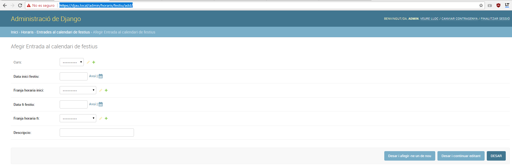

# Tareas Recomendables

Antes de dar el ultimo paso podríamos hacer una serie de cosas:

* Asignar el Rol de Dirección a los profes que lo necesiten, este rol les permitirá acceder a casi todos los módulos y funciones de la app, para cambiar roles dirigirse aquí \[URL\_DJAU\]/admin/auth/user/. Seleccionar el usuario al que quieras cambiar el ROL y asignarle el ROL de Dirección. 

* También deberíamos ponerle un nombre descriptivo a las Materias y asignarle el tipo de Materia, lo podemos hacer desde aquí: \[URL\_DJAU\]/admin/assignatures/assignatura/
* Deberíamos establecer los periodos de vacaciones y festivos, para que los cálculos de los horarios se hagan correctamente

* Finalmente es recomendable asignar los Tutores de cada grupo, esto permitirá al profesor Tutor acceder al modulo Tutoria, donde hacer una serie de funciones sobre su grupo. Para ello dirígete aquí: 

como ya habrás observado la carga masiva de datos nos ahorra mucho trabajo pero no es magico, deberemos añadir datos a mano para enriquecer la app, para ello tienes el poderoso panel de administración de Django, donde podrás gestionar todos los Activos del centro.

[https://djau.local/admin/](https://djau.local/admin/)

&nbsp;

> **Usar el Panel de administración con cuidado**

&nbsp;
