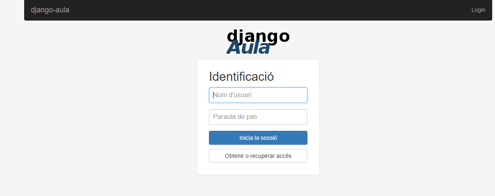
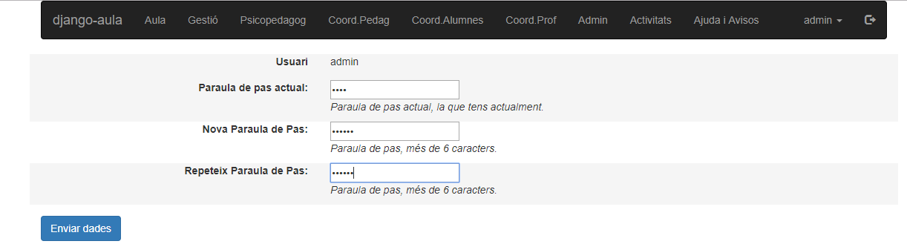
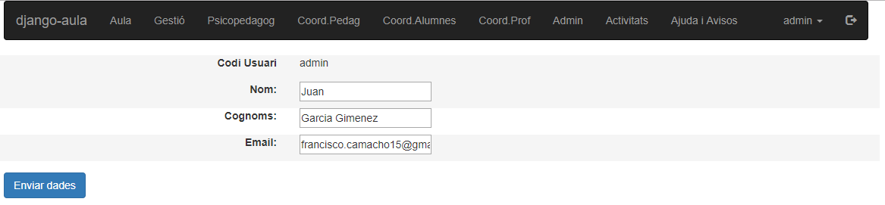
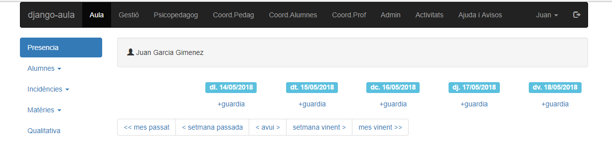

[comment]: # (description: Este documento contiene información sobre el primer arranque de la aplicación.)

### Primer Inicio

Si se ha producido una instalación satisfactoria usted podrá ver la siguiente pantalla:

Inicie sesión con las credenciales creadas en la instalación para el usuario admin de la app, la primera vez que inicies sesión la app te pedirá que cambies la contraseña.

Ahora deberá volver a iniciar sesión y te pedirá mas información para el perfil \(nombre,correo ..etc\)

Una vez introducida la información, podrás ver el panel de control de la aplicación

